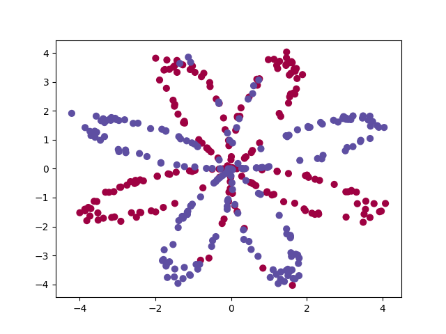

# Planar data classification with one hidden layer 
---

Implement a 2-class classification neural network with a single hidden layer. Application on Planar data classification.


## Packages

* [numpy](https://numpy.org/) is the fundamental package for scientific computing with Python.
* [matplotlib](https://matplotlib.org/) is a library to plot graphs in Python.
* [sklearn](https://scikit-learn.org/stable/) provides simple and efficient tools for data mining and data analysis. 


### Instructions

Run the code with:

```bash
 python3  main.py
```


---

## Result

The goal of this classifier is to find the decision boundary separating the blue and the red data in the following planar data 

<p align="center">
  
</p>

The decision bounbary is obtained as

<p align="center">
  
</p>

