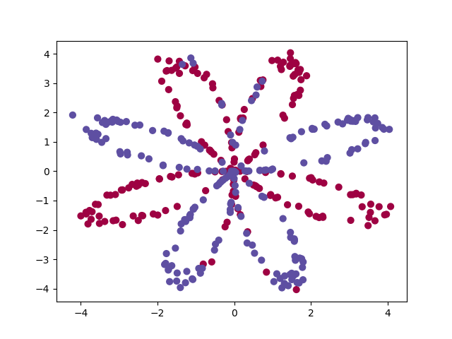
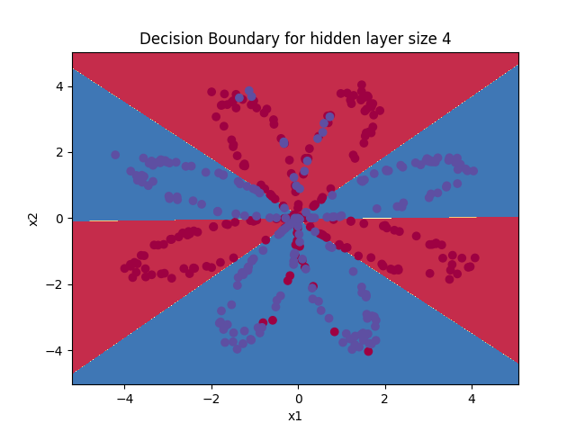

# Planar Data Classification with one Hidden Layer Neural Network  

---

## Instructions

This code needs the following librairies: [numpy](https://numpy.org/install/), [matplotlib](https://matplotlib.org/stable/users/installing.html) and [sklearn](https://scikit-learn.org/stable/install.html).


Run the code with:

```bash
 python3  main.py
```


---

## Result

The goal of this classifier is to find the decision boundary separating the blue and the red data in the following planar data 

<p align="center">
  
</p>

The decision bounbary is obtained as

<p align="center">
  
</p>


---
### Copyright

Copyright (C) [2021] [deeplearning.ai]

